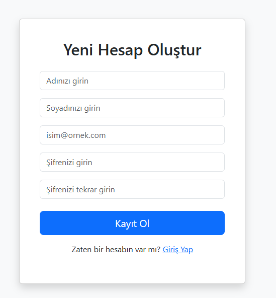

[Readme.md](https://github.com/user-attachments/files/23717088/Readme.md)
# JWT Mini Project � ASP.NET Core 8.0

## A��klama

Bu proje, **manuel kullan�c� y�netimi** ile JWT (JSON Web Token) �reten bir ASP.NET Core 8.0 uygulamas�d�r.  
Kullan�c�lar sisteme giri� yapt�ktan sonra **Token Olu�tur** butonuna basarak JWT alabilirler.

- Kullan�c� i�lemleri(Login,Register) manuel olarak yap�lm��t�r.
- Token olu�turma ve g�sterme **TokenController** �zerinden yap�l�r.  
- Kullan�c� login de�ilse, Token sayfas�na eri�im engellenir.
- Kullan�c� login oldu�unda token �retilir.

---

## �zellikler

- Kullan�c� Register ve Login i�lemleri  
- JWT token �retme  
- �retilen token�� web sayfas�nda g�sterme  
- Login olmayan kullan�c�lar� AccessDenied hatas� y�nlendirme
- Program.cs deki Registiration kodlar�n� ilgili katmanlarda yazma

---

## Teknolojiler

- ASP.NET Core 8.0  
- Entity Framework Core  
- AutoMapper  
- JWT Authentication  

---

## Kurulum

1. Repository�i klonlay�n:

```bash
git clone https://github.com/sehercelikk/JWTMiniProject.git
cd JWTMiniProject

2.Secret.json veya appsettings.json dosyas�nda JWT ve Veritaban� bilgilerini doldurun:

```bash
{
  "Jwt": {
    "Key": "BuKendiUretti�inizGizliKey",
    "Issuer": "JwtProject",
    "Audience": "JwtProject"
  },
  "ConnectionStrings": {
    "DefaultConnection": "Server=(localdb)\\MSSQLLocalDB;Database=JwtProjectDb;Trusted_Connection=True;"
  }
}

3. Database�i olu�tur ve migration�lar� uygula:
```bash
PMC: Add-Migration InitialCreate
PMC: Update-Database

```

### Login Sayfas�


### Register Sayfas�


### Token Sayfas�


