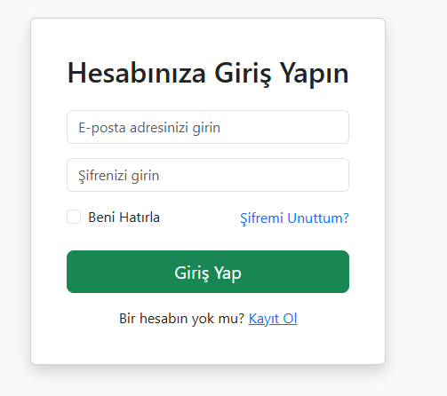
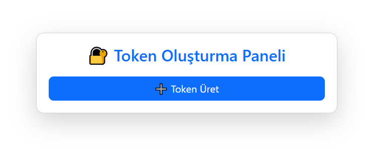
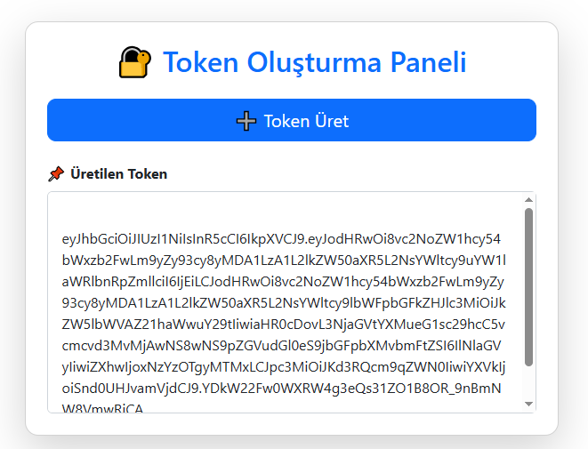

# JWT Mini Project – ASP.NET Core 8.0

## Açıklama

Bu proje, **manuel kullanıcı yönetimi** ile JWT (JSON Web Token) üreten bir ASP.NET Core 8.0 uygulamasıdır.  
Kullanıcılar sisteme giriş yaptıktan sonra **Token Oluştur** butonuna basarak JWT alabilirler.

- Kullanıcı işlemleri(Login,Register) manuel olarak yapılmıştır.
- Token oluşturma ve gösterme **TokenController** üzerinden yapılır.  
- Kullanıcı login değilse, Token sayfasına erişim engellenir.
- Kullanıcı login olduğunda token üretilir.

---

## Özellikler

- Kullanıcı Register ve Login işlemleri  
- JWT token üretme  
- Üretilen token’ı web sayfasında gösterme  
- Login olmayan kullanıcıları AccessDenied hatası yönlendirme
- Program.cs deki Registiration kodlarını ilgili katmanlarda yazma

---

## Teknolojiler

- ASP.NET Core 8.0  
- Entity Framework Core  
- AutoMapper  
- JWT Authentication  

---

## Kurulum

1. Repository’i klonlayın:

```bash
git clone https://github.com/sehercelikk/JWTMiniProject.git
cd JWTMiniProject

2.Secret.json veya appsettings.json dosyasında JWT ve Veritabanı bilgilerini doldurun:

```bash
{
  "Jwt": {
    "Key": "BuKendiUrettiğinizGizliKey",
    "Issuer": "JwtProject",
    "Audience": "JwtProject"
  },
  "ConnectionStrings": {
    "DefaultConnection": "Server=(localdb)\\MSSQLLocalDB;Database=JwtProjectDb;Trusted_Connection=True;"
  }
}

3. Database’i oluştur ve migration’ları uygula:
```bash
PMC: Add-Migration InitialCreate
PMC: Update-Database

```

### Login Sayfası


### Register Sayfası


### Token Sayfası




